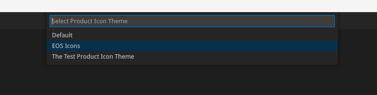

# EOS Icons for VSCode

This extension allows you to replace VSCode's default icons with those from the
[EOS icon set](https://eos-icons.com/).


## Usage

Install the extension from the Marketplace, execute the command `Preferences:
Product Icon Theme` and select the entry `EOS Icons` in the presented drop down:




## Development

To build the extension yourself, you will need the following packages installed:

- nodejs
- yarn
- python

and execute the following commands to setup your development environment:
```ShellSession
$ yarn install
$ yarn run prepare
```

To build the extension itself, execute `yarn run package`.

To try the extension out in VSCode, open this folder in VSCode and press `<f5>`
to launch a debugging session. This will create a fresh VSCode instance with the
extension pre-installed and loaded. Note that sometimes the icon theme is not
properly loaded on launch, in that case switch the Product Icon Theme to the
default and back to EOS Icons.

## Learn more about the EOS UX/UI Solutions

- [EOS Icons](https://eos-icons.com)

- [EOS User Story](https://userstory.site)

- [Follow us on Twitter](https://twitter.com/eos_uxui)

- [Join us on Slack](https://slack.userstory.site)

